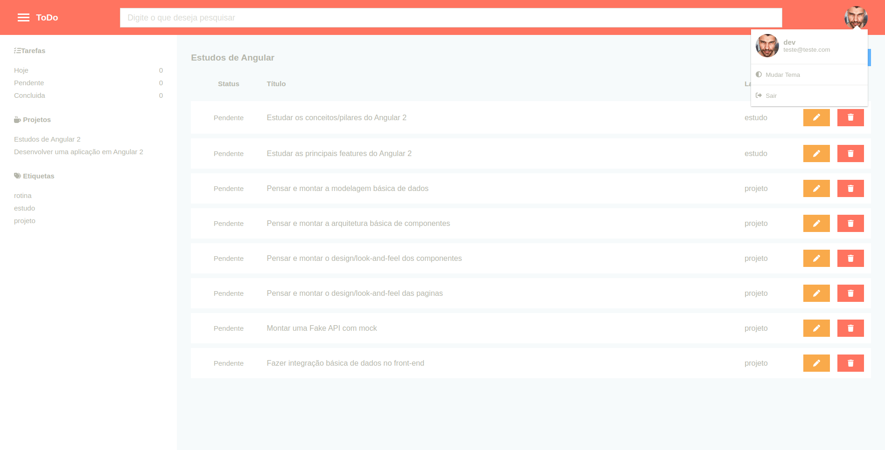
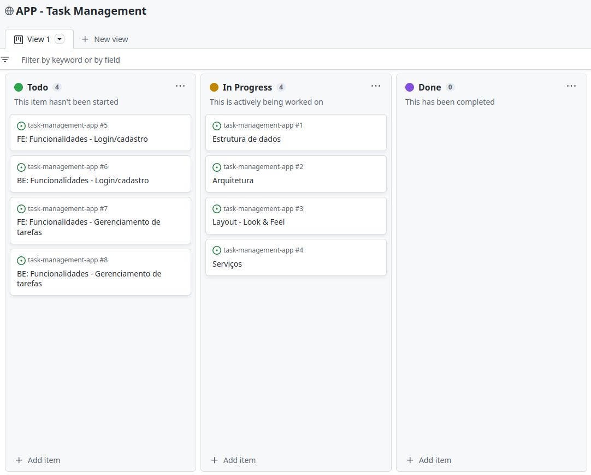

# :rocket: Task Managent

:construction: ...
App para gerenciamento de tarefas...

    

## :factory: Recursos

* [ ] Login/cadastro
* [ ] Acesso offline
* [ ] Gerenciamento de tarefas
* [ ] Lista personalizadas
* [ ] Lembretes e notificação
* [ ] Personalização - tema

## :wrench: Tecnologias

### Back-end

:construction: ...

### Front-end

* Angular 2
* Sass

__Detalhes__: :point_right: [ veja aqui ](code/front-end)
## :file_folder: Estrutura

* :file_folder: code
    * :open_file_folder: back-end/
        * ...
    * :open_file_folder: front-end/
        * ...
* :file_folder: docs

## :clock330: Gerenciamento

Gerenciamento e evolução do projeto se dá via [issues](https://github.com/chen-zhenn/task-management-app/issues) organizado com sistema de **Kanban** pelo [project](https://github.com/users/chen-zhenn/projects/7) do Github. 

    

